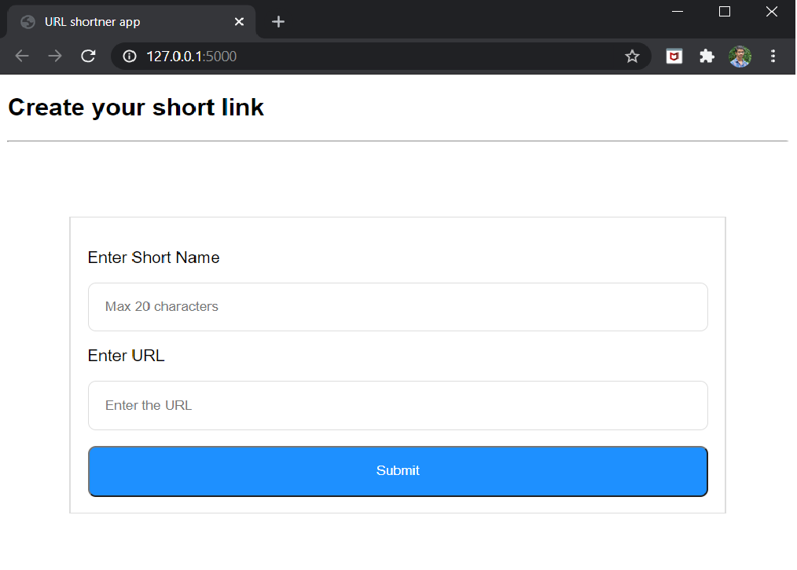

## URL Shortner App Using Flask

### Overview
- In this episode we will create our own URL shortner app using Flask and SQLAlchemy.
- To see the YouTube demonstration of this tutorial [click here](https://youtu.be/ilW7g7nddM0)

### Setting up the environment
- Download this [Pipfile.lock](https://github.com/ASHIK11ab/Flask-Series/tree/url-shortner-app/Pipfile.lock) and install the necessary dependencies by running
  ```bash
    > pipenv sync
  ```
- This will install the dependencies from Pipfile.lock

### Note:
> - Since pipfile varies accross various operating systems. If you get into trouble installing the dependencies. Then,
> - Manually install the dependencies by running
>  ```bash
>   > pipenv install Flask SQLAlchemy validators psycopg2
>  ```

### Step by Step Guide
1. Import all the necessary functions from Flask
```python
  from flask import Flask, request, render_template, redirect
```

1. Create your flask application
```python
  app = Flask(__name__)
```

1. Create an index route for your application which renders an index.html template
```python
  @app.route('/')
  def index():
    return render_template('index.html')
```

1. In the index.html file create a form by which users can input their URL and they can choose a short name for the URL
```html
  <!DOCTYPE html>
  <html lang="en">
  <head>
    <meta charset="UTF-8">
    <meta name="viewport" content="width=device-width, initial-scale=1.0">
    <title>URL shortner app</title>
    <link rel="stylesheet" href="{{ url_for('static', filename='/css/index.css') }}" >
  </head>
  <body>
    <h2>Create your short link</h2><hr>
    <form action="{{ url_for('index') }}" method="post">
      <label>Enter Short Name</label>
      <input type="text" name="name" placeholder="Max 20 characters" maxlength=20>

      <label>Enter URL</label>
      <input type="text" name="url" placeholder="Enter the URL" maxlength=200>

      <button>Submit</button>
    </form>
  </body>
  </html>
```
  1. In the above html file we have create a form with two input fields and a button.
  1. We have linked our stylesheet using jinja syntax.
  ```html
    <link rel="stylesheet" href="{{ url_for('static', filename='/css/index.css') }}" >
  ```
  1. The form sends the data to then index function through POST method.

1. Now lets style the form.
```css
  * {
    font-family: Helvetica;
  }

  form {
    width: 600px;
    padding: 1rem;
    border: 1px solid #ddd;
    margin: 10% auto;
  }

  label {
    display: block;
    margin-top: 1rem;
    margin-bottom: 1rem;
  }

  input {
    width: 100%;
    border: 1px solid #ddd;
    border-radius: 8px;
    padding: 1rem;
    box-sizing: border-box;
  }

  button {
    width: 100%;
    background-color: dodgerblue;
    color: #fff;
    margin-top: 1rem;
    padding: 1rem;
    border-radius: 8px;
  }

  button:hover {
    cursor: pointer;
  }
```
  1. We are giving the form a fixed width and some padding and border radius.
  1. We style the label to display as a block element and we give it some margin bottom.
  1. We give some padding and border radius to the input field.
  1. We give a background color and text color and we give it some padding.

1. After styling this is how our index page will look.
<p align="center">
  
</p>

1. Now we need to get the input data in the backend. Since our index route is also going to accept a POST request we need to specify the list of methods that this route should accept.
```python
  @app.route('/', methods=["GET", "POST"])
  def index():
    if request.method == "POST":
      short_name = request.form.get('name')
      url = request.form.get('url')
```

  1. If the request method is POST we get the two input data.

1. If the user inputs an URL without protocol we add the protocol to the url.
```python
  if 'http' not in url:
      url = f'http://{url}'
```

1. Now we need to make sure that the url is a valid url and the short name which the user chose is available.
```python
  if valid_url(url):
    if name_available(short_name) is None:
      add_url(short_name, url)
      return render_template("success.html", short_name=short_name)
    else:
      return render_template('index.html', msg='Short name not available')
  else:
    return render_template('index.html', msg='Invalid url')
```
  1. If the URL is a valid URL and if the short name is available we add the URL to our database and notify the user that their short link has been created sucessfully.
  1. We render a success.html template and we pass the short name as an parameter to the template. 
  1. If the URL is not valid or if the short name is not available we return the index.html template with an error message.

1. Now we need to create the functions which we are using in the index route. We will create all these function in [utils.py](https://github.com/ASHIK11ab/Flask-Series/tree/url-shortner-app/utils.py)

1. In order to validate the URL we will use the validators library.
```python
  import validators

  def valid_url(url):
    return validators.url(url) is True
```
  1. This function returns true if the URL is valid or false otherwise.

1. In order to query the database we need to create a database object.
```python
  from sqlalchemy import create_engine
  from sqlalchemy.orm import scoped_session, sessionmaker

  DATABASE_URL = 'postgresql://<username>:<password>@localhost:5432/<database_name>'
  engine = create_engine(DATABASE_URL)
  db = scoped_session(sessionmaker(bind = engine))
```

1. Lets first have a look at our database in which we have a single relation with the name url_info.
```
           List of relations
  Schema |   Name   | Type  | Owner
  --------+----------+-------+-------
  public | url_info | table | ashik
```

1. The table URL info has three fields id, short_name, url.
```
   id | short_name | url
  ----+------------+-----
```

1. The name_available function checks whether the short name which the user chose is available.
```python
  def name_available(name):
    return db.execute("select short_name from url_info where short_name = :name",
  {"name" : name}).fetchone()
```
  1. This function will return a short name from the database if the short name is exists in the database.
      > Here the :name is SQLAlchemy syntax. When this query is executed the :name will be replaced by the value of the key name which is passed as a dictionary as the second parameter.

1. Now we need to create a function add_url which will add the URL and its short_name to the database.
```python
  def add_url(name, url):
    db.execute("insert into url_info (short_name, url) values (:name, :url)",
      {
        "name": name,
        "url": url
      })
    db.commit()
```

1. Consolidating everything this is how our index route should look now
```python
@app.route('/', methods=["GET", "POST"])
def index():
  if request.method == "POST":
    short_name = request.form.get('name')
    url = request.form.get('url')

    if 'http' not in url:
      url = f'http://{url}'
    
    if valid_url(url):
      if name_available(short_name) is None:
        add_url(short_name, url)
        return render_template("success.html", short_name=short_name)
      else:
        return render_template('index.html', msg='Short name not available')
    else:
      return render_template('index.html', msg='Invalid url')
  return render_template('index.html')
```

1. Now its time to create our actual application. When a user visits the short link we need to redirect the user to the actual URL.

1. Lets first create a route using the path converter which is going to accept the short links.
```python
  @app.route('/<path:short_name>')
  def redirect_url(short_name):
    url = get_url(short_name)
    if url is None:
      return "<h2 style='color:red'> Invalid short link </h2>"
    return redirect(url.url)
```
  1. Now we need to make sure that the short name is a valid so that we can redirect user to the actual URL.

1. Lets create the function get_url which returns a record from the database if the short name exists.
```python
  def get_url(short_name):
    return db.execute("select * from url_info where short_name = :short_name",
      {
        "short_name" : short_name
      }).fetchone()
```

1. If short name does not exist this function returns None and we return an error message 'invalid short link'.

1. If the short name is valid this function returns a record from the database and we redirect the user to the actual URL by
```python
  return redirect(url.url)
```

### Now its time to run our app
<p align="center">
  
</p>

[[Back to top](#url-shortner-app-using-flask)]

## Contributors:
<a href="https://github.com/ASHIK11ab">
   
</a> 

[Ashik Meeran Mohideen](https://github.com/ASHIK11ab)

&copy; copyrights 2020. All rights reserved.

Licensed under [MIT LICENSE](https://github.com/ASHIK11ab/Flask-Series/blob/main/LICENSE)